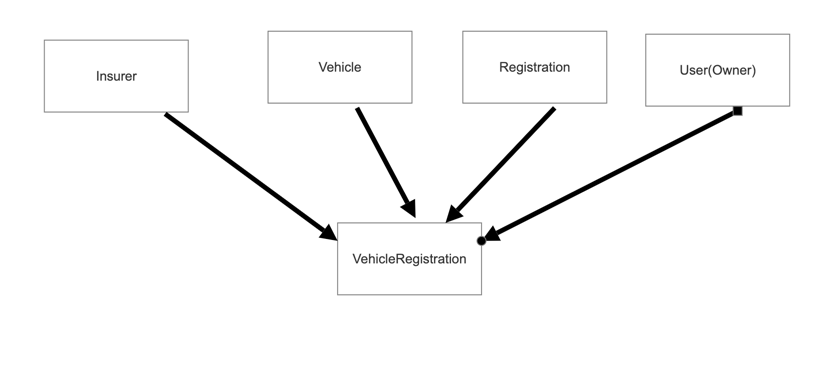

# Getting Started

## Introduction
Nsw Revenue component included 4 API that allows clients to retrieve and add Vehicle 
### Guides
The following guides illustrate how to use some features concretely:

## Documentation
[Swagger](http://localhost:8080/swagger-ui/index.html?configUrl=/v3/api-docs/swagger-config)

Create username/pass :
- /users/ : 
-            Use this API for creating new User . 
-            Validation role : Password len should be at least 3.
Authentication API :
- /accessToken : use this API to get JWT token for running Secure API.
Secured API:
- /users/vehicles/registration : register a vehicle for authorized user (current user which login in the system) 
- /users/vehicles  : return vehicles of authorized user (current user)

## Schema
below is an ERD diagram :

For details of each table please refer to Schemas part in  [Swagger](http://localhost:8080/swagger-ui/index.html?configUrl=/v3/api-docs/swagger-config)

## Testing

test cases will be run when maven builds the project.

## Code coverage

The reports will be created after the compilation of the test phase(Maven test).
The code coverage report is written to the directory target/site/jacoco/index.html.

## How to build the project

via docker :
  run ./mvnw spring-boot:build-image -Dspring-boot.build-image.imageName=nsw-revenue-api:latest in terminal
without docker :
  run mvn clean install in command line 

## How to run the project
via docker :
 run docker run -p 8080:8080 -t nsw-revenue-api:latest in terminal
without docker :
 java -jar <Mave_repo_path>/repository/nsw/revenue/coding/challenge/1.0/challenge-1.0.jar nsw.revenue.coding.challenge.Application

## About H2 console 

for checking H2 data via web , use http://localhost:8080/h2-console/login.do (username : admin , password : password)

## question and answer  (Not a coding task)
1- As an API owner, describe (in a short para) how can others get access to your API?
   
Please refer to  [Swagger](http://localhost:8080/swagger-ui/index.html?configUrl=/v3/api-docs/swagger-config) 

2- If your datastore is HUGE with millions of records, what measures will you take
to make your API more stable?

I think the best way is adding Filtering, Sorting, and Pagination also if there is still too many records we can make the api as asynchronous and store records in a file .
